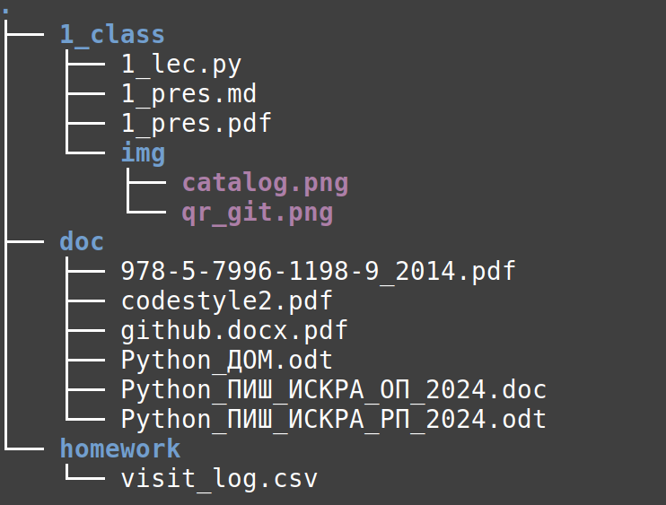

## *Петербургский государственный университет путей сообщения Императора Александра I*

# Введение в Python

Ведет: *аспирант 2 года* **Волков Егор Алексеевич**
***gole00201@gmail.com***
ауд. 11 - 304

 
Санкт-Петербург 2024

---
## План работ
- **10** лабораторных работ + **курсовой проект**
- **1** тестовая работа
- **Зачет**

---

## Задачи
- Познакомиться с понятием алгоритмов и структур данных
- Научиться работать с редактором VScode
- Научиться работать с интерпретатором CPython
- Научиться применять Python в обработке статистических данных

---

## Как работаем?

---
## Структура каталога

---

## Порядок работы

- Заводим себе [гитхаб](../doc/github.docx.pdf)
- Создаем **свой публичный** репазиторий name_second_name_pish
- В нем создаем папку под домашнее задание
- Выкладываем в неё выполненное дз

---
## Toolchain (рекомендуемый)

- [Vscode](https://code.visualstudio.com/) (с расширением для Python)
- [Python 3](https://www.python.org/)
- [git](https://git-scm.com/)
- [wsl](https://learn.microsoft.com/ru-ru/windows/wsl/install) (если очень хочется)

---
## Python
- Типы данных
- Ссылки на объекты
- Коллекция данных
- Логические операции
- Инструкции управления потоком выполнения
- Ввод/вывод
---

## Лабораторная работа №1
1) Ввести натуральное число вывести квадраты и кубы всех чисел от 1 до этого числа.
Число не превосходит 100.
Формат входных данных: Одно целое число, не превосходящее 100
Формат результата: Для каждого из чисел от 1 до введенного числа напечатать квадрат
числа и его куб.
---

2) Ввести два целых числа a и b (a ≤ b) и вывести квадраты всех чисел от a до b.
Формат входных данных: Два целых числа по модулю не больше 100
Формат результата: Квадраты чисел от a до b.

---

3) Ввести два целых числа a и b (a ≤ b) и вывести сумму квадратов всех чисел от a до b.
Формат входных данных: Два целых числа по модулю не больше 100
Формат результата: Сумма квадратов от первого введенного числа до второго

---

4) Ввести целое число и определить, верно ли, что все его цифры расположены в порядке
возрастания.